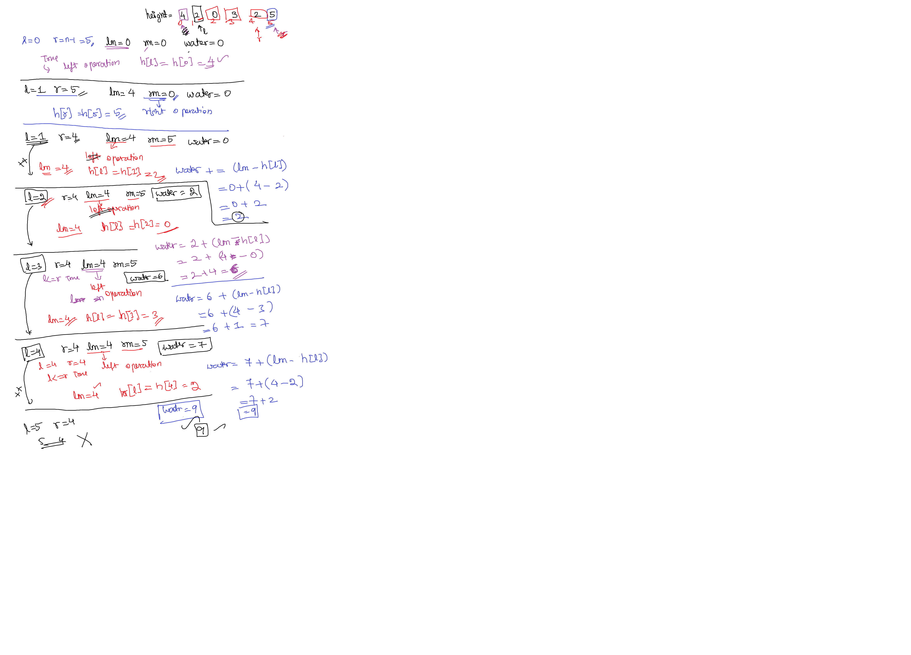

# plan

## trapping rain water problem

```java
class Solution {
    public int trap(int[] h) {
        int n = h.length;
        int water = 0;
        int l = 0, r = n-1;
        int lm = 0, rm = 0;
        while ( l <= r ) {
            if( lm <= rm ){
                if (h[l] >=  lm)
                    lm = h[l];
                else
                    water += ( lm - h[l]);
                l+=1;
            } else {
                if (h[r] >= rm)
                    rm = h[r];
                else
                    water += ( rm - h[r] );
                r-=1;
            }
        }
        return water;
    }
}
```


## explanation

```bash

LC_EXPLAINATION:
#  while (l<=r):
    - here left will always on left     ( smaller )
    - here right will be always on right( bigger  )
    - both can be pointing to same index also.
# if ( lm <= rm )
    - which max is small go to that side.
    - if lm is smaller than rm. 
        - we will deal with left side
    - if rm is smaller than lm.
        - we will deal with right side
# if ( lm <= h[l] )
    - lm >  left maximum height
    - h[l]  current height
    - If current height is greater than lm
        - then update the new found max height.
# else:
    - you have to calculate the water. 
# formula for calculating water value.
    water = water + (lm - h[l])
    water = water + (rm - h[r])
```

